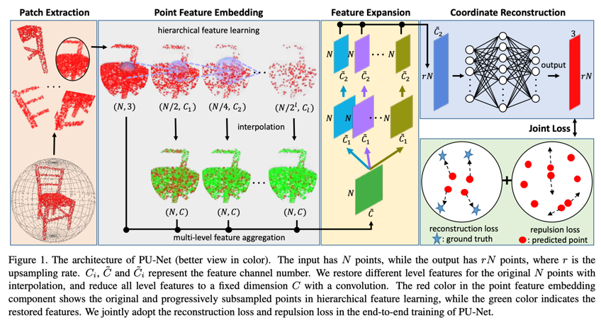

# [PU-Net: Point Cloud Upsampling Network](https://openaccess.thecvf.com/content_cvpr_2018/papers/Yu_PU-Net_Point_Cloud_CVPR_2018_paper.pdf)

## Architecture


The code has been tested with Python 3.7.10, Pytorch1.9.0, CUDA 10.1 on Ubuntu 18.04.

##Installation
**pointnet2-ops:**

```bash 
pip install "git+git://github.com/erikwijmans/Pointnet2_PyTorch.git#egg=pointnet2_ops&subdirectory=pointnet2_ops_lib"
```

**EMD loss:**

```bash 
cd emd
python setup.py install
```

## Links
[1] [yulequan/PUNet-tensorflow](https://github.com/yulequan/PU-Net)

[2] [lyqun/PUNet-Pytorch](https://github.com/lyqun/PU-Net_pytorch)

[3] [erikwijmans/pointnet2-ops](https://github.com/erikwijmans/Pointnet2_PyTorch)

[4] [daerduoCarey/PyTorchEMD](https://github.com/daerduoCarey/PyTorchEMD)
